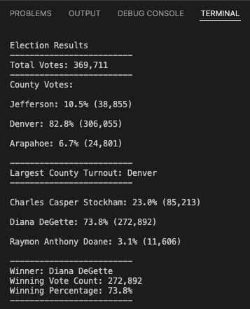

# Election Audit Using Python

## Overview of Election Audit
The purpose of this election audit was to analyze raw voter data from a congressional election in Colorado to create a vote count report and certify the election results. Specifically, the analysis determined the total number of votes cast in the election, the number and percentage of total votes that came from each county in the congressional precinct, the county with the largest number of votes, the number and percentage of total votes received by each candidate, and the winning candidate. These results will be outlined in the Election Audit Results section below. The analysis was performed using a Python script that can be modified to analyze data from elections at various levels, which will be discussed further below.

## Election Audit Results
All analysis for this congressional election audit was performed using the [election results dataset](Resources/election_results.csv). A [Python script](PyPoll_Challenge.py) was developed to:
-	Read the raw data contained in the election results CSV file; 
-	Loop through the rows of data to create lists of all candidates who received votes and counties that participated in the election, sum total votes (using an accumulator variable), and sum votes by candidate and county (using accumulator variables and candidate and county dictionaries to store the counts); 
-	Calculate percentages of votes by candidate and county; 
-	Determine the candidate and county with the most votes; and 
-	Write a concise summary of the results to both the terminal and a text file. 

The results of the election audit were as follows:
-	A total of **369,711** votes were cast in the election.
-	The distribution of votes across counties in the precinct was as follows:
    - **Denver County** had the **largest number of votes** with **306,055**, representing **82.8%** of total votes cast in the election.
    - **Jefferson County** had **38,855** votes, representing **10.5%** of total votes cast.
    - **Arapahoe County** had the smallest number of votes with **24,801**, representing **6.7%** of total votes cast.
-	The breakdown of votes received by each candidate was as follows:
    - **Diana DeGette** received **272,892** votes, representing **73.8%** of total votes cast. **Ms. DeGette won the election by a significant margin.**
    - **Charles Casper Stockham** received **85,213** votes, representing **23.0%** of total votes cast.
    - **Raymon Anthony Doane** received **11,606** votes, representing **3.1%** of total votes cast.

These results are summarized in this [election analysis text file](Analysis/election_analysis.txt). The display of the summarized results from the terminal is shown below.

## Election Audit Summary
The Python script developed for this election audit can be used to analyze results from elections at any level with minor modification. For a local election where all votes come from within a single city or county, the portion of the script that creates the list of counties from which votes were received, sums the votes for each county, and calculates the percentage of total votes for each county could simply be removed. 

If the script were used for a larger election, such as a Senate election where votes come from all counties in the state, the script would not require any modification to be able to loop through the raw election data and create the longer list of counties and sum and store the total vote count for each county, thanks to the functionality of for loops, lists, and dictionaries within the script. The same would be true if the script were used for an election with more candidates.

The script could also be used for an election where voters were voting for or against a piece of legislation instead of for a candidate. In that case, the vote cast would be Yes or No instead of the name of the candidate. Where the current script uses a for loop to loop through all rows of raw data to create the list of unique candidates, we could instead simply create a list of vote_values = [“Yes”, “No”]. We could then use the for loop to loop through the rows to sum Yes and No votes with accumulator variables and store them in a dictionary with keys “Yes” and “No” as the current script does with county names. 

Finally, the script could be modified to provide additional insight into the votes cast in an election. For example, the election data analyzed for this audit included votes cast with mail-in ballot, punch card, and direct recording electronic methods. If the raw data included an additional voting method column, the script could be modified to also create a list of voting methods used, sum votes for each voting method and store the vote counts in a voting method dictionary with the methods as keys and vote counts as values, and calculate the percentage of votes cast using each method. 
